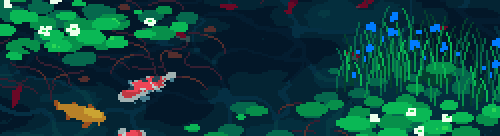

# 💫 About Me:

👋 Hi, I'm Min Thant Naung (aka Metricgralic), a 20-year-old developer.  🎯 Currently on a journey to master Full-Stack Development.  🎨 I have a strong foundation in UI/UX design, ensuring the applications I build look as good as they function.  💻 Deep diving into JavaScript and React to strengthen my technical stack.  

## 🌐 Socials:

## 🚀 What I'm Up To:

- 🛠️ **Building:** **AlgoMock**, an AI-powered mock interview platform.

- 📱 **Sharing:** Daily coding insights and tech content over on my dev page, **PolterGit**.

- ⌨️ **Workflow:** Navigating my projects and writing code efficiently using **Neovim**.

# 💻 Tech Stack:

                                

# 📊 GitHub Stats:

 

 

## 🏆 GitHub Trophies

### ✍️ Random Dev Quote

